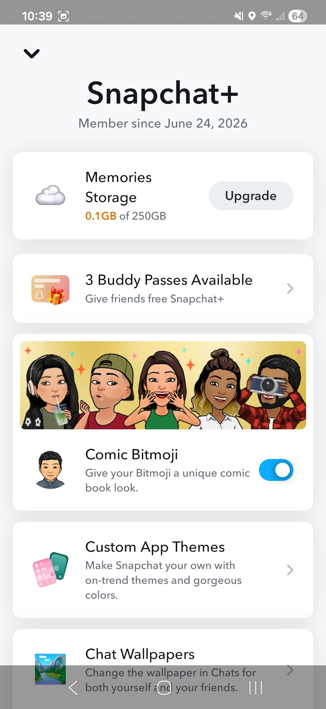
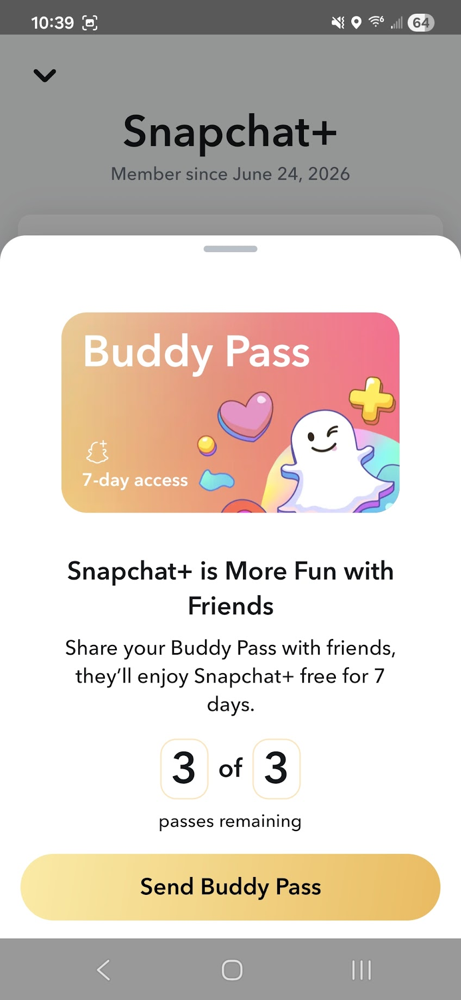
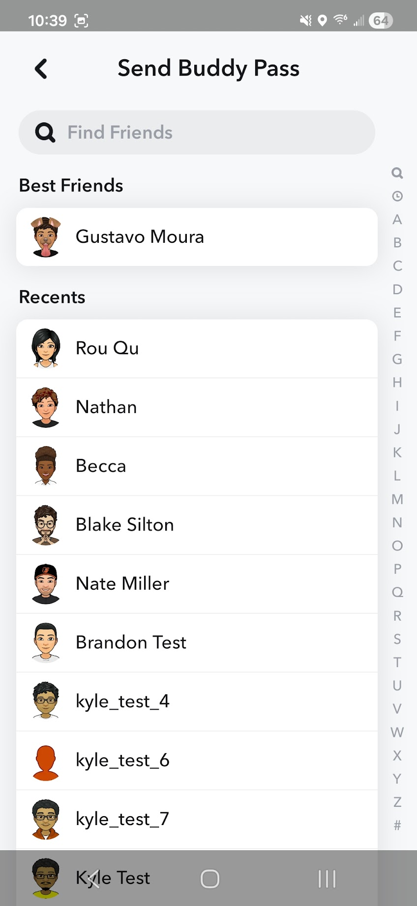
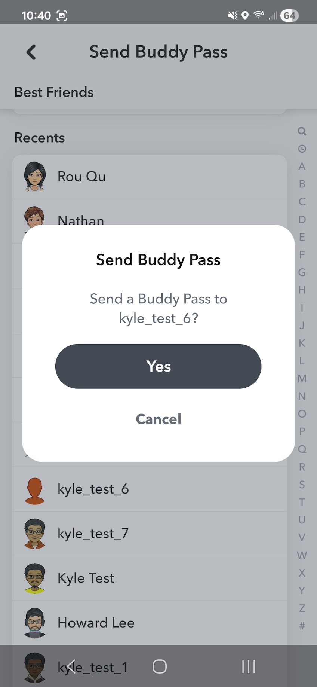
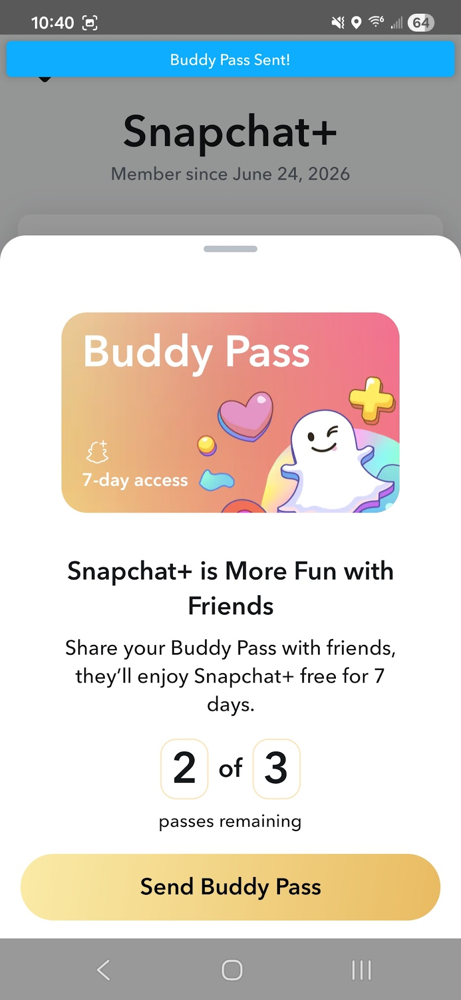
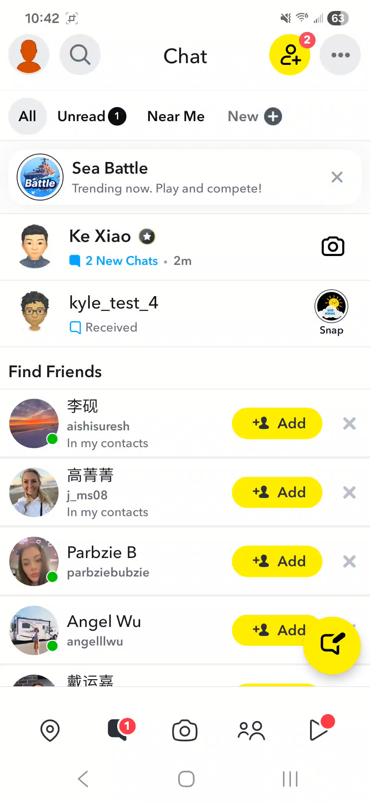
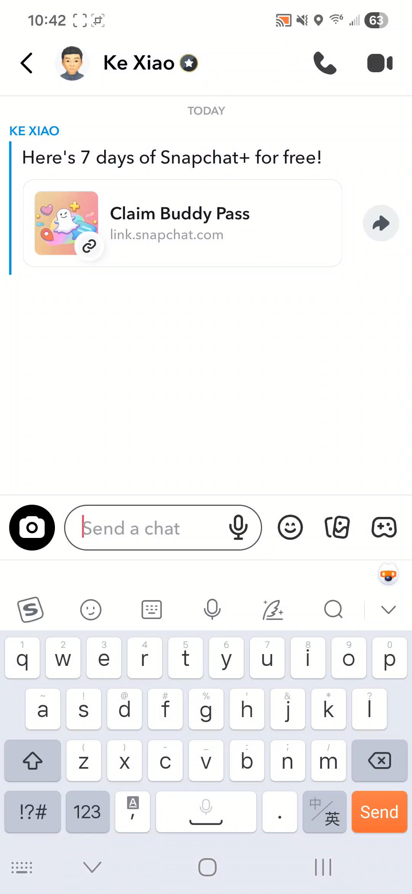
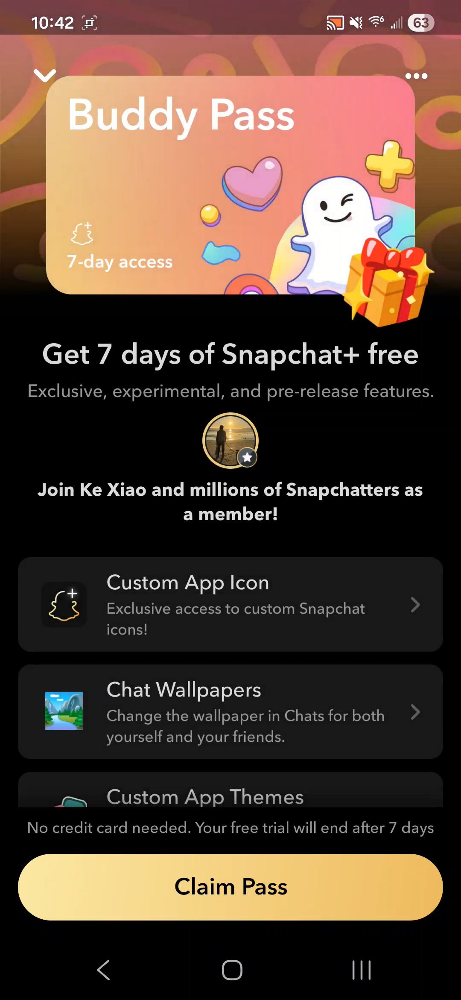
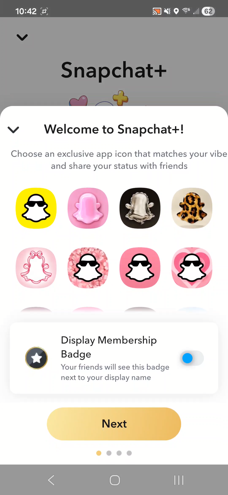

# Ke Xiao's Portfolio

Here is a simple portfolio of client features I made for Snap.

## Buddy Pass

Snapchat+ subscribers can send 3 buddy passes/month to their friends.

### Sending a Buddy Pass

<table>
  <tr>
    <td align="center"></td>
    <td align="center"></td>
    <td align="center"></td>
    <td align="center"></td>
    <td align="center"></td>
  </tr>
  <tr>
    <td align="center"><em>Step 1 — Entry point in management page</em></td>
    <td align="center"><em>Step 2 — Landing page</em></td>
    <td align="center"><em>Step 3 — Select recipient</em></td>
    <td align="center"><em>Step 4 — Confirm recipient</em></td>
    <td align="center"><em>Step 5 — Success notification</em></td>
  </tr>
</table>

🎥 [Watch the send flow (video)](buddy_pass/buddy_pass_send.mp4)

### Receiving & Redeeming a Buddy Pass

<table>
  <tr>
    <td align="center"></td>
    <td align="center"></td>
    <td align="center"></td>
    <td align="center"></td>
  </tr>
  <tr>
    <td align="center"><em>Step 1 — New Chat notification</em></td>
    <td align="center"><em>Step 2 — Notification message</em></td>
    <td align="center"><em>Step 3 — Redeem page</em></td>
    <td align="center"><em>Step 4 — Welcome page</em></td>
  </tr>
</table>

🎥 [Watch the redeem flow (video)](buddy_pass/buddy_pass_redeem.mp4)
