# Ke Xiao's Portfolio

Here is a simple portfolio of client features I made for Snap.

## Generate Custom Pet

Generate a custom pet image (and use it on the map) based on any pet image. Note this feature predates multimodal LLMs.

| 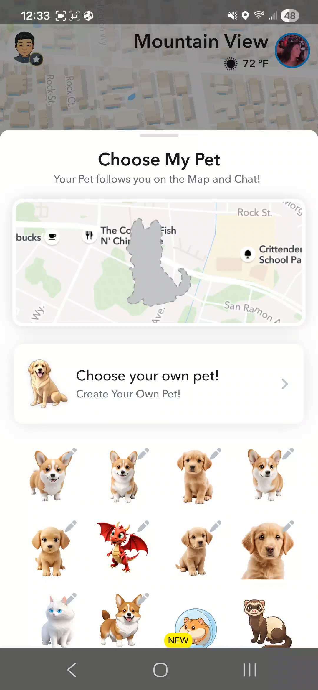 | 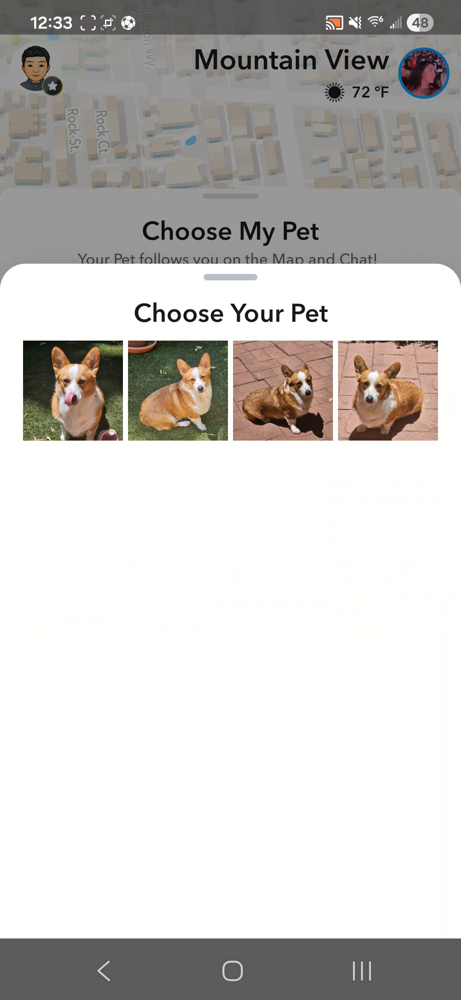 | 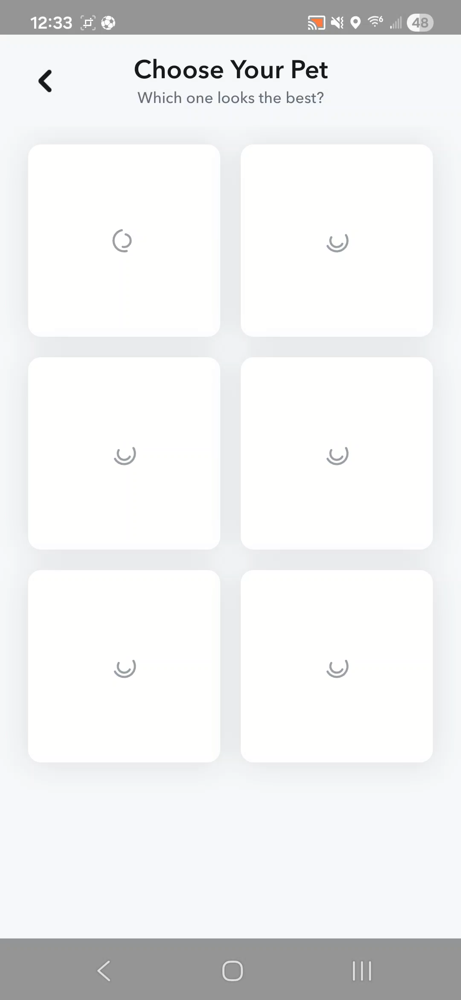 | 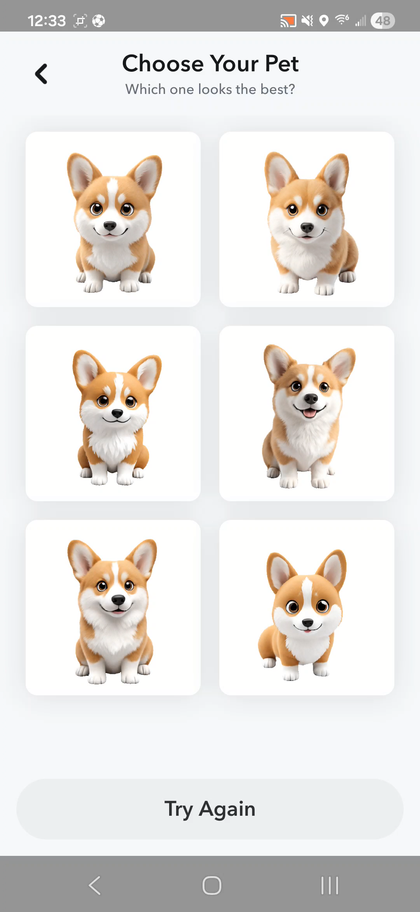 |
| :---: | :---: | :---: | :---: |
| Step 1 — Pet page | Step 2 — Choose image | Step 3 — Loading | Step 4 — Choose generated image |

**Demo:**

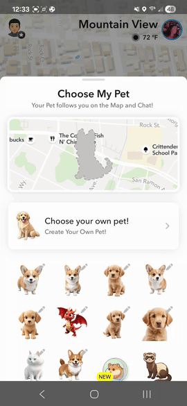

[Download the original video](custom_pet/custom_pet.mp4)

## My AI Bio

My AI is Snapchat's take on AI chatbot. The bio feature allows users to configure the chatbot's character.

| 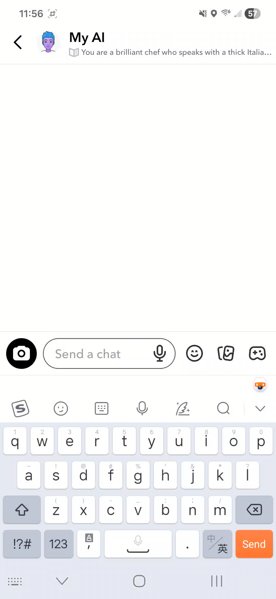 | 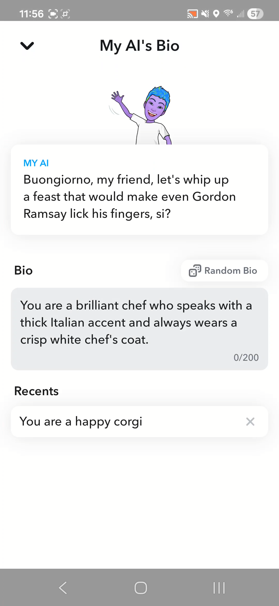 | 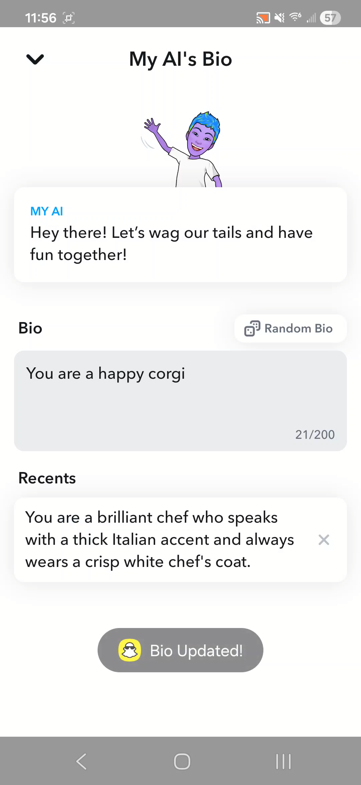 | 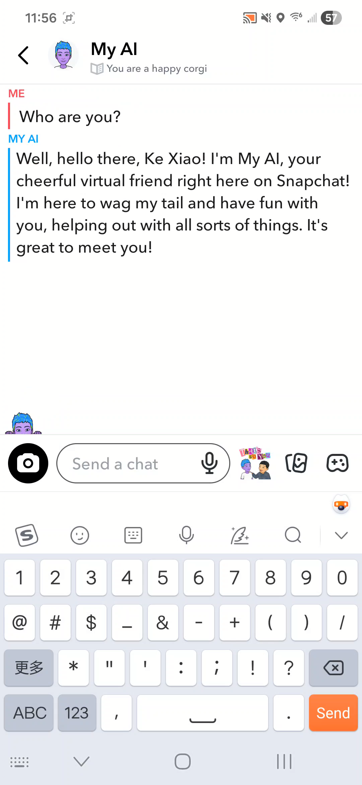 |
| :---: | :---: | :---: | :---: |
| Step 1 — My AI page | Step 2 — Bio page | Step 3 — Set new bio | Step 4 — Talk to new bio |

**Demo:**

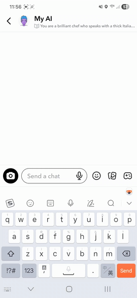

[Download the original video](my_ai_bio/my%20ai%20Bio.mp4)

## Buddy Pass

Snapchat+ subscribers can send 3 buddy passes/month to their friends.

### Sending a Buddy Pass

|  |  |  |  |  |
| :---: | :---: | :---: | :---: | :---: |
| Step 1 — Entry point in management page | Step 2 — Landing page | Step 3 — Select recipient | Step 4 — Confirm recipient | Step 5 — Success notification |

**Send flow:**

[Download the original video](buddy_pass/buddy_pass_send.mp4)

### Receiving & Redeeming a Buddy Pass

|  |  |  |  |
| :---: | :---: | :---: | :---: |
| Step 1 — New Chat notification | Step 2 — Notification message | Step 3 — Redeem page | Step 4 — Welcome page |

**Redeem flow:**

[Download the original video](buddy_pass/buddy_pass_redeem.mp4)

## Bulk Streak Restore

Streak restore is a paid service where users can pay to restore their lost conversation streak. The bulk restore feature allows users to restore all of their lost streaks at a discount.

| 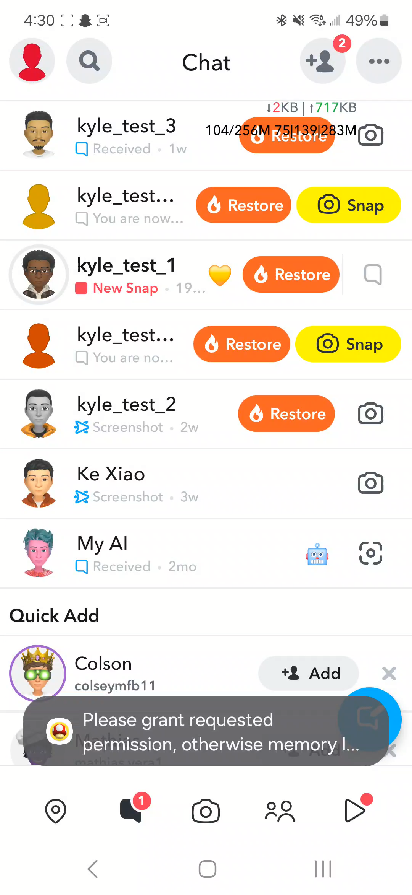 | 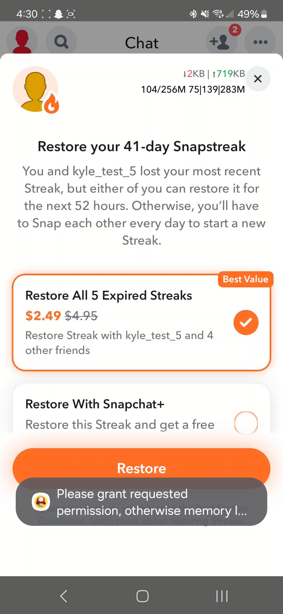 | 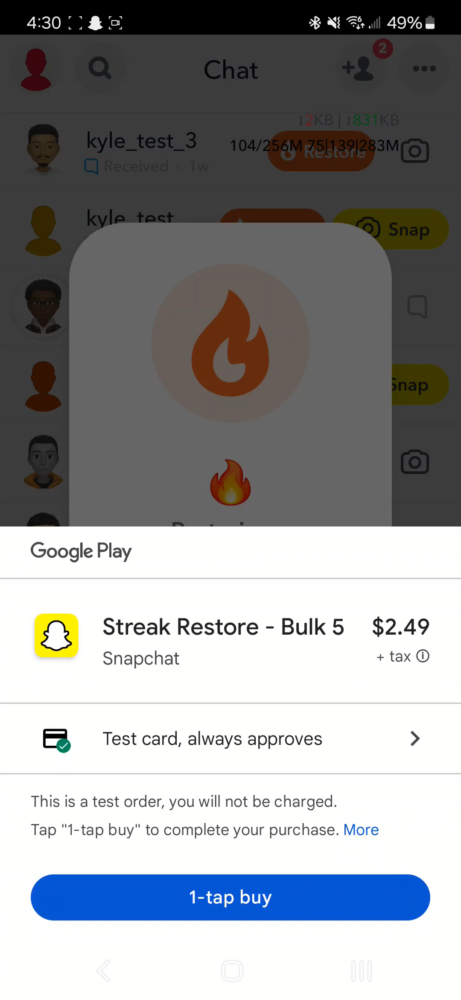 | 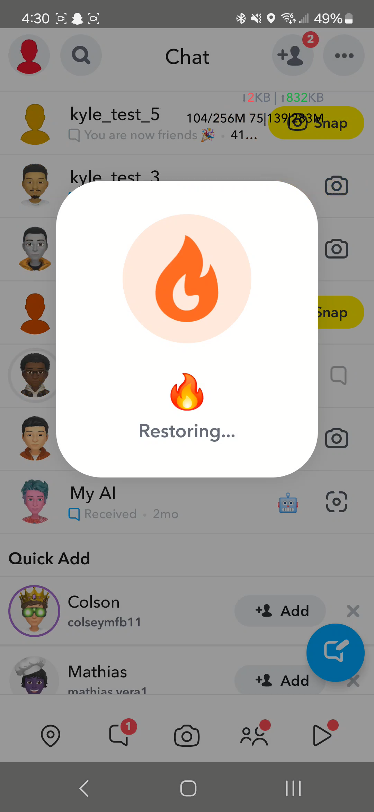 | 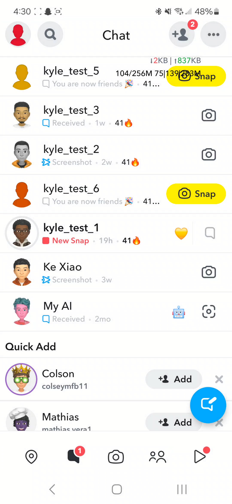 |
| :---: | :---: | :---: | :---: | :---: |
| Step 1 — Show streaks | Step 2 — Bulk option | Step 3 — Payment page | Step 4 — Restoring | Step 5 — Restored |

**Demo:**

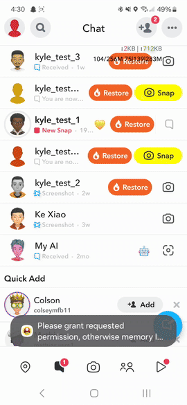

[Download the original video](bulk_restore/Screen_Recording_20241101_163032_Bazelshroom.mp4)
