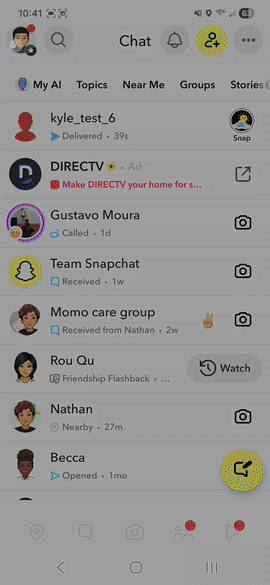
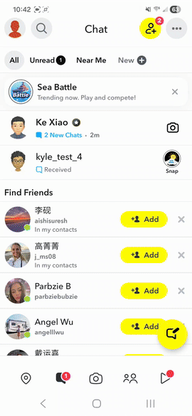

# Ke Xiao's Portfolio

Here is a simple portfolio of client features I made for Snap.

## Buddy Pass

Snapchat+ subscribers can send 3 buddy passes/month to their friends.

### Sending a Buddy Pass

|  |  |  |  |  |
| :---: | :---: | :---: | :---: | :---: |
| Step 1 — Entry point in management page | Step 2 — Landing page | Step 3 — Select recipient | Step 4 — Confirm recipient | Step 5 — Success notification |

**Send flow:**

[Download the original video](buddy_pass/buddy_pass_send.mp4)

### Receiving & Redeeming a Buddy Pass

|  |  |  |  |
| :---: | :---: | :---: | :---: |
| Step 1 — New Chat notification | Step 2 — Notification message | Step 3 — Redeem page | Step 4 — Welcome page |

**Redeem flow:**

[Download the original video](buddy_pass/buddy_pass_redeem.mp4)
